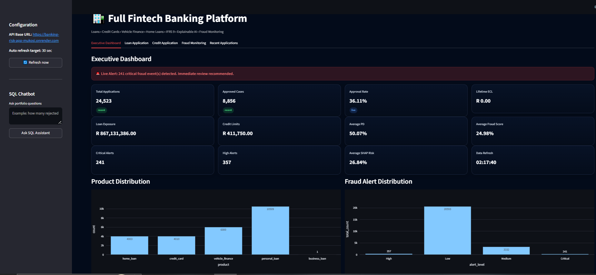
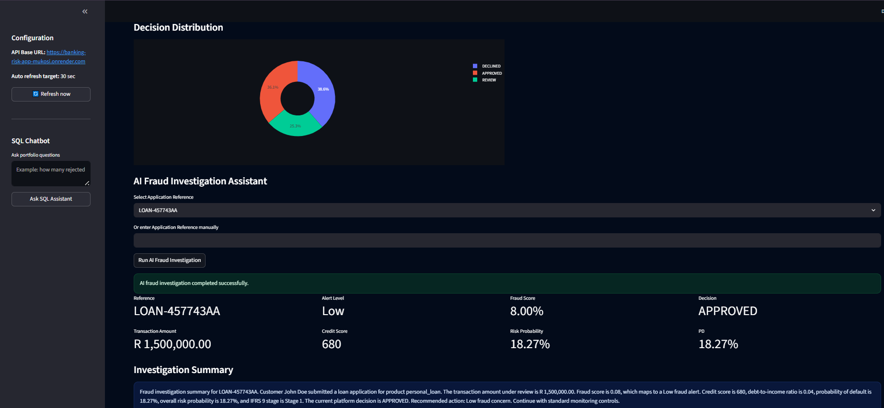
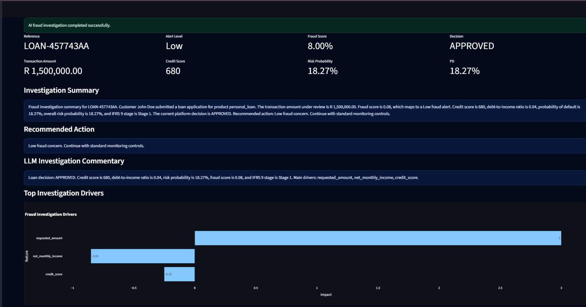

# 🏦 Banking Risk Intelligence Platform

A production-style fintech platform that integrates **credit risk modelling, fraud detection, explainable AI, and agentic AI investigation** into a single intelligent decision system.

---

## 🚀 Live Application

👉 **Main App (Frontend):**  
https://banking-risk-platform-mukosi.streamlit.app  

> This is the primary link you should share.

---

## 🎯 Business Problem

Financial institutions must:
- Assess **creditworthiness**
- Detect **fraud in real-time**
- Monitor **portfolio risk exposure**

This platform solves all three through a **unified AI-driven decision engine**.

---

## 🧠 Core Capabilities

- 📊 Credit Risk (PD, IFRS9, ECL)
- 🚨 Fraud Detection & Alerts
- 🔍 Explainable AI (SHAP-style insights)
- 🤖 Agentic AI Investigation
- 🌐 Graph-Based Fraud Detection
- 📈 Executive Dashboard
- 💬 SQL AI Assistant

---

## 📸 Screenshots

### Executive Risk Dashboard
Real-time monitoring of portfolio KPIs, fraud alerts, and risk distribution.

---

### AI Fraud Investigation
Agent-based AI system performing full fraud and credit risk analysis.

---

### Explainable AI Dashboard
Transparent model decisions with top risk drivers.

---

## 🏗️ Architecture

Streamlit (Frontend)  
→ FastAPI (Backend API)  
→ Agent Layer (Decision Intelligence)  
→ ML Models + Graph Engine  
→ Azure SQL Database  
→ LLM (Explainability)

---

## 🧰 Tech Stack

- Python
- FastAPI
- Streamlit
- Azure SQL
- Scikit-learn
- XGBoost
- Plotly

---

## 📂 Project Structure

api/ → Backend services  
app/ → Streamlit frontend  
src/ → ML, agents, scoring, graph logic  

---

## 🔐 Security

- Environment variables for credentials
- Secrets excluded from GitHub
- Streamlit authentication layer implemented

---

## 👨‍💻 Author

Mashudu Mukosi  
Data Analyst | Data Scientist | Risk & AI Systems

---

